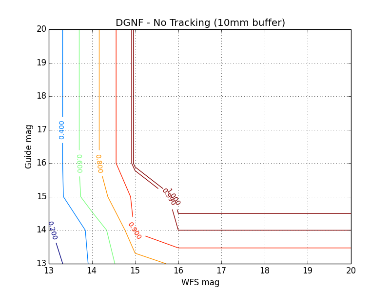
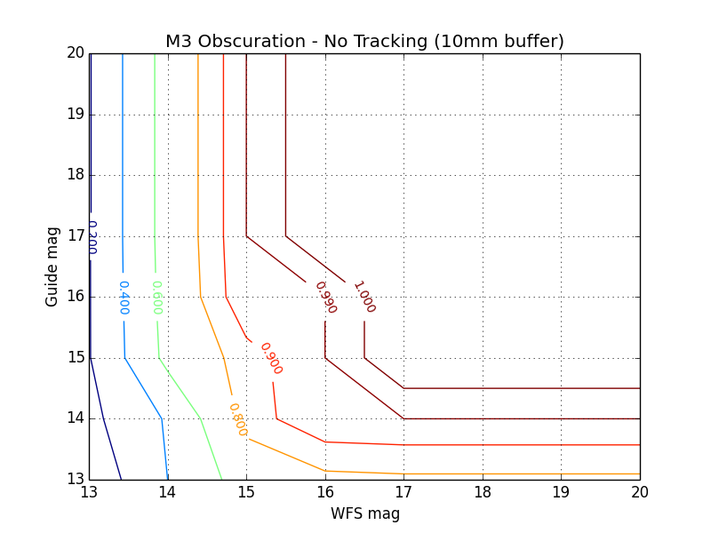

## Skycover

This code is for simulating the probes that collect light for the
Aquisition Guide Star and Wave Front Sensing (AGWS) system of the
Giant Magellan Telescope (GMT). The goal of this project is to
determine the probabilities of finding sufficiently bright stars for
doing wavefront sensing.

## Running

I wrote this code on OS X 10.11.4 (El Capitan). This is what I get
when I run `g++ --version`.

    Configured with: --prefix=/Applications/Xcode.app/Contents/Developer/usr --with-gxx-include-dir=/usr/
    include/c++/4.2.1                                                                                   
    Apple LLVM version 7.3.0 (clang-703.0.31)
    Target: x86_64-apple-darwin15.6.0
    Thread model: posix
    InstalledDir: /Applications/Xcode.app/Contents/Developer/Toolchains/XcodeDefault.xctoolchain/usr/bin

To build the project, run `make` in the top level directory. This will
compile an executable named <b>skycov</b>.

The program takes seven command line arguments, all mandatory. Here is
the usage message:

    usage: ./skycov <--4probe | --phasing> <--gclef | --m3 | --dgnf> <--track | --notrack> <--print | --noprint> <wfsmag> <gdrmag> <nfiles>

And brief explanations of the arguments:

    arg 1: regular simulation or phasing
    arg 2: obscuration type. '--dgnf' for no obscuration
    arg 3: tracking or notracking
    arg 4: print configurations or not
    arg 5: wfsmag
    arg 6: gdrmag
    arg 7: number of files to test

The program will read in star field data from the star catalogues in
the <b>Bes</b> directory, and return the probability of finding the
given wave-front/guide-star magnitude pair in any one of the
files. The probability formula is

    (# of valid files) / (# of files tested)

The validity of a file depends on which test is being run. There are
two test types, <b>4probe</b> and <b>phasing</b>.

For the <b>4probe</b> test, a valid file contains a configuration of
stars such that three probes can reach a star of at least the given
wave-front magnitude, and one probe can reach a star of at least the
given guide-star magnitude. A valid configuration must also be one
where none of the probes are colliding with each other, or are blocked
by an obscuration.

For the <b>phasing</b> test, only three probes need to be able to
reach a star of at least the given wave-front magnitude. The
guide-star magnitude is ignored in this case. The phasing test also
takes into account probe collisions and obscuration by M3.

The second command line argument determines which obscuration, if any,
will be used. Passing in '--gclef' will cause an obscuration polygon
to be read out of the file 'gclef_obsc.txt'. Passing in '--m3' will
cause an obscuration polygon to be read out of 'm3_obsc.txt'. And
passing in '--dgnf' will cause no obscuration to be used, as there is
no obscuration to take into account in the direct gregorian narrow
field configuration.

The format of the obscuration files must be one ordered pair per line,
with x and y coordinates separated by a single tab.

Ex. gclef_obsc.txt

    -306.63	1388.34
    330.15	-149
    -128.09	-338.81
    -764.88	1198.53

The order of the points given in the obscuration file should follow
clockwise or counterclockwise order around the polygon, as the
geometry algorithms in the program use this format to reason about
polygons.

The third command line argument toggles the tracking test. The
tracking configuration tests whether all four probes are able to
follow a bright enough star as the field of view rotates for 60
degrees above the stationary mirror. This means for the <b>4probe</b>
configuration, three probes must follow a star at least as bright as
the given wave-front magnitude, and one probe must follow a star at
least as bright as the given guide-star magnitude. A caveat of the
tracking configuration is that any probe may 'backtrack' to another
star of sufficient magnitude if the star it is currently following
leaves its range. This backtracking ability is simulated in the
program, and as usual probe collisions and obscuration are taken into
account.

The fourth command line argument tells the program whether or not you
want the coordinates of each probe and obscuration to be printed out
at every valid configuration. For the non-tracking test, this results
in a single frame of animation per valid configuration. For the
tracking test, this results in 60 frames of animation per valid
configuration.

When using the --print option, it's a good idea to redirect output to
some output file. Example

     ./skycov --4probe --gclef --track --print 14 15 10 > sky.out

Since the resulting probability will be printed to stderr, you get
your answer and the printed coordinates in separate locations.

## Running a full test

I've included two scripts, <b>run4probe.sh</b> and
<b>runphasing.sh</b>, that will test a whole range of magnitudes at
once. <b>run4probe.sh</b> tests all possible wfs/gdr magnitude pairs
between 13 and 19, inclusive. <b>runphasing.sh</b> tests all wfs
magnitudes between 13 and 19. The 4probe script takes the same
arguments as the skycov executable, minus the simulation type and
given magnitudes.

    ./run4probe <--gclef | --m3> <--notrack | --track> <nfiles>

The phasing script takes only the number of files to test, as the
phasing configuration must use M3 and does not do tracking.

    ./runphasing <nfiles>

## Probe geometry

The four probes are identical in shape, and are described by the
polygon files 'probe_slider_body.txt', 'probe_slider_shaft.txt', and
'probe_baffle_tube.txt'. Each file contains one of three polygons that
make up the probe's geometry. The probe described as these polygons is
rotated about the origin to describe the other three probes.

There are two reasons the probes are described as multiple
polygons. First, the baffle tube extends and contracts based on the
radial distance of the probe's star from the origin. Second, the
polygon intersection algorithm used by the program cannot handle
concave shapes.

## Results

These plots display the results of running the simulation in different
configurations.

## Visual Simulation

The '--print' option enables viewing the valid configurations found by
the program. When printing is turned on, the program will output the
coordinates of all the polygons in the system whenever a valid
configuration is found. This means for the non-tracking setting, a
single set of coordinates will be printed out for each polygon in the
system. For the tracking setting, a set of coordinates will be printed
out for every polygon in the system, for every one of 60 positions
along the 60 degree tracking path.

With the print option, the program will also attempt to print the
valid starfields to files in a directory named 'starfiles'. So if you
would like to use the print option to see the visual simulation, you
should create a folder in the toplevel called 'starfiles'.

The coordinates of a polygon are printed out in ordered pairs in a
single line. The m3 obscuration is printed out like this

    (829.100000, 918.240000) (80.740000, 66.650000) (10.100000, 104.200000) (297.630000, 1200.830000) 

I've included matlab scripts that will plot the configurations output
by the simulation program. But since the coordinates are output as
text it's possible to write a parser/plotter in any language.

This is a frame displaying one valid configuration output by the
command

    ./skycove --4probe --m3 --notrack --print 15 15 10 > sky.out

To run the visual simulations, open matlab and cd to the matlab
directory. To run a non-tracking simulation, run
`iterprobes('../starfiles', '../sky.out')`. The arguments to
iterprobes are the directory containing the starfields and the file
containing the polygon coordinates printed out by the simulation. To
run a tracking simulation, run `iterprobes_tracking('../starfiles',
'../sky.out')`. The arguments are the same.

Beware there are a few limitations of the matlab scripts that I
haven't found a good way to abstract away. If you would like to
simulate a dgnf test, you must go into the file, either iterprobes.m
or iterprobes_tracking.m, and change the 'dims' variable at the top of
the script from [4 4 4 4] to [4 4 4]. This is because the dgnf doesn't
have an obscuration polygon to read out of the file. The 'dims'
variable gives the number of point on the polygons described in the
file.

Another thing you must do if you would like to run a dgnf visual
simulation is go into the file, iterprobes.m or iterprobes_tracking.m,
and change the 'npolygons' variable from 13 to 12. This tells the
script to display 12 polygons (3 for each probe) per frame, instead of
13 (3 for each probe plus the obscuration).

The blue dots in the picture represent stars. These stars are read
from conventionally named text files in the 'starfiles'
directory. Each run of the simulation overwrites these files to
contain the starfields from valid files found during that
simulation. So the simulation might look off if you are viewing
polygons from a few simulations ago.